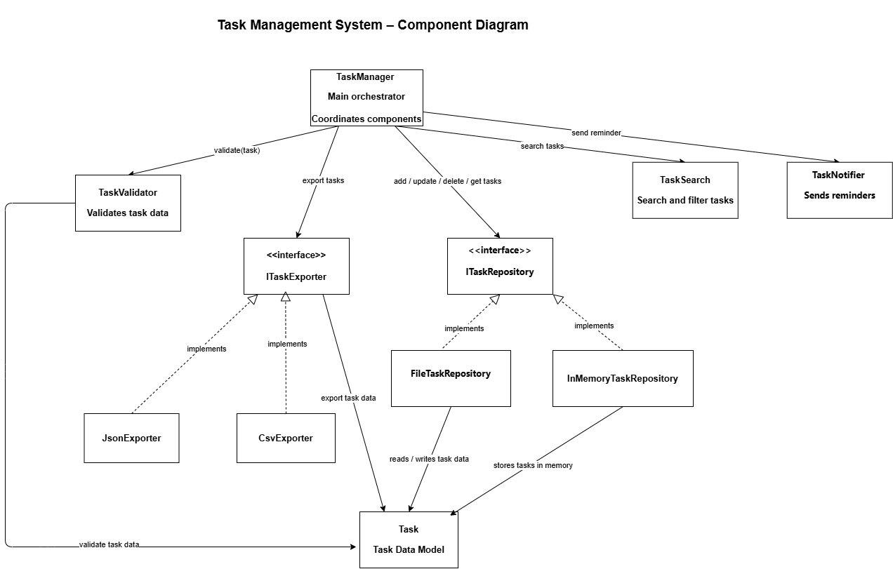

# Part 2 – Cohesion and Coupling Analysis
 
## Component Diagram
 

 
---
 
# Cohesion Analysis
 
Cohesion refers to how strongly related the responsibilities inside a component are.  

High cohesion means that a component focuses on a single well-defined responsibility.
 
### TaskManager

The TaskManager component has **functional cohesion**.  

It coordinates operations such as creating, updating, searching, exporting, and notifying tasks by delegating work to other components.
 
### TaskValidator

TaskValidator has **functional cohesion** because it only validates task data before it is processed or stored.
 
### TaskSearch

TaskSearch also has **functional cohesion**, as it is responsible only for filtering and searching tasks.
 
### TaskNotifier

TaskNotifier has **functional cohesion** since its single responsibility is sending task reminders.
 
### TaskRepository Implementations

InMemoryTaskRepository and FileTaskRepository both have **functional cohesion**.  

Their responsibility is limited to storing and retrieving task data.
 
### TaskExporter Implementations

JsonExporter and CsvExporter have **functional cohesion** because they focus only on exporting tasks to specific formats.
 
Overall, each component in the system has **high cohesion** because it performs a single well-defined function.
 
---
 
# Coupling Analysis
 
Coupling describes the level of dependency between components.
 
The system was designed to maintain **low coupling** through the use of interfaces and dependency injection.
 
### Interface-based dependencies
 
TaskManager depends on:
 
- ITaskRepository

- ITaskExporter
 
rather than concrete implementations.
 
This allows implementations to be swapped without modifying the TaskManager.
 
For example:
 
- InMemoryTaskRepository can be replaced with FileTaskRepository

- JsonExporter can be replaced with CsvExporter
 
without changing the system logic.
 
### Component independence
 
Each component communicates with others through clearly defined interfaces, which minimizes direct dependencies and reduces coupling.
 
This design improves flexibility, maintainability, and testability.
 
---
 
# Single Responsibility Principle (SRP)
 
The system follows the **Single Responsibility Principle**, meaning each component has only one reason to change.
 
| Component | Responsibility | Reason to Change |

|----------|---------------|------------------|

TaskManager | Orchestrates task operations | Change in workflow logic |

TaskValidator | Validates task data | Change in validation rules |

TaskSearch | Searches and filters tasks | Change in search logic |

TaskNotifier | Sends reminders | Change in notification mechanism |

InMemoryTaskRepository | Stores tasks in memory | Change in memory storage logic |

FileTaskRepository | Stores tasks in files | Change in file persistence |

JsonExporter | Exports tasks to JSON | Change in JSON format |

CsvExporter | Exports tasks to CSV | Change in CSV format |
 
Because each component has a single clear responsibility, the system achieves **high modularity and maintainability**.
 